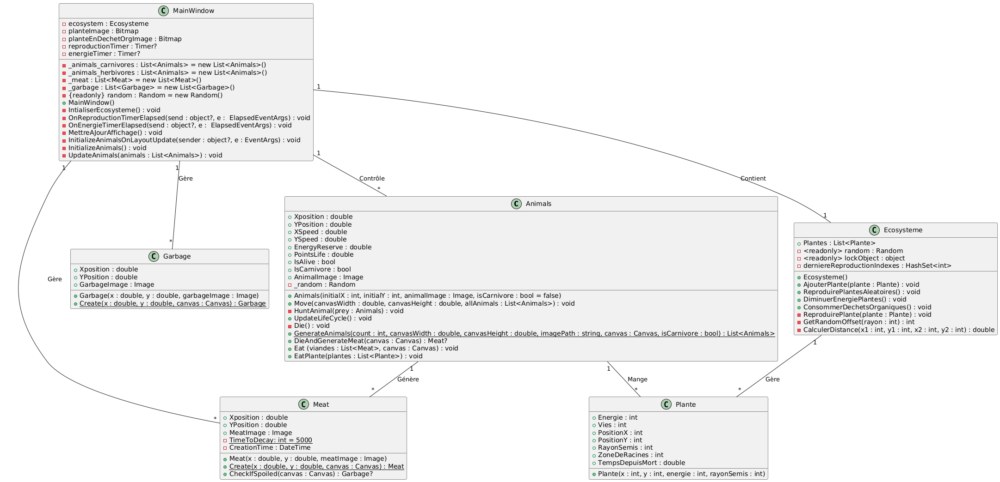
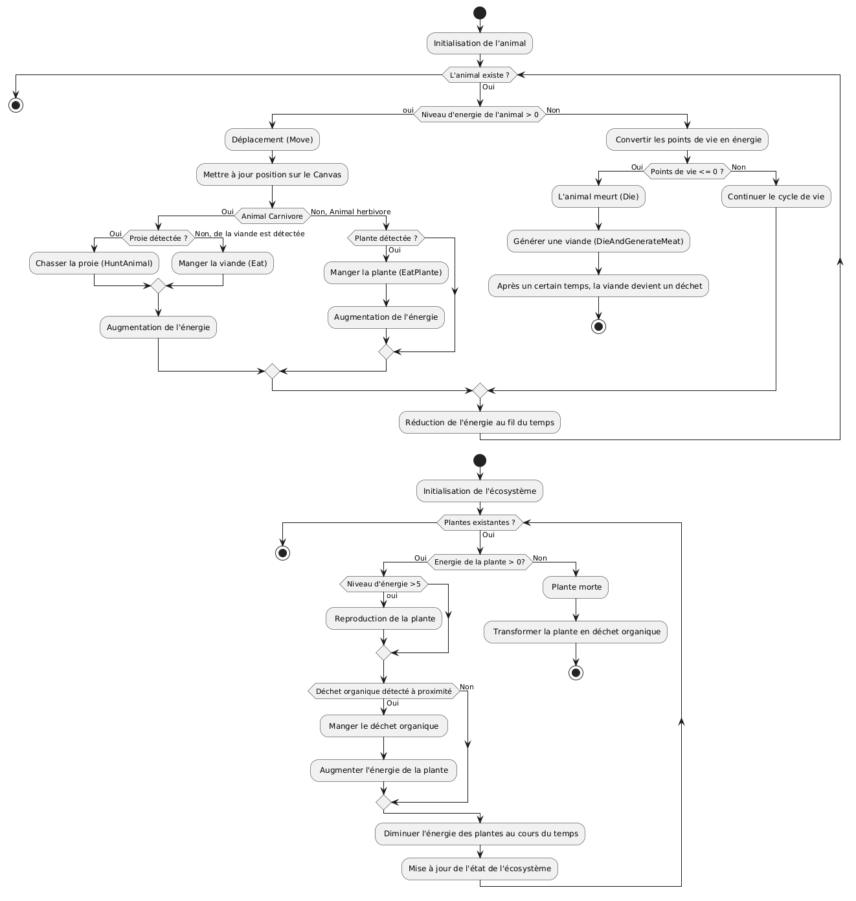

# Projet Ecosystème - réalisé par Bikass Imane (22231) et Mournin Ibtihal (22210)

Le but de ce projet est de simuler un écosystème simplifier capable de gérer les interractions entre des animaux carnivores, des herbivores, ainsi que des végétaux. 

Les animaux doivent être capable de se reproduire, de se nourir, de chasser (pour les carnivores), mais également de mourir et de se décomposer. 

Les plantes, quant à elles, doivent également être en mesure de se reproduire, de se nourir de déchets organiques, et d'être mangées par des herbivores. 

Pour information, le travail a été séparé en deux. Ibtihal s'est chargé de tout ce qui est lié à l'implémentation du comportement animal, et Imane s'est chargé de l'implémentation du comportement des végétaux. C'est la raison pour laquelle les logiques d'implémentation utilisées ne sont pas toujours les mêmes pour un comportement similaire. Idéalement, il aurait mieux fallu homogénéiser le code, mais faute de temps, nous nous sommes contentées de mettre en commun nos codes. 

## Diagrammes 

### Diagramme de classes

### Diagramme de d'activité

### Diagramme de séquence

## Principes SOLID

### Single Responsibility Principle - SRP

Dans ce projet, on a cherché à respecter le principe de responsabilité unique en attribuant une tâche bien définie à chaque classe. Par exemple, la classe Animals gère uniquement les comportements des animaux, comme leur déplacement, leur
alimentation, tandis que la gestion des déchets associés aux animaux a été déléguée à une classe séparée Garbage.

Cependant, ce principe n’est pas strictement respecté dans tous les cas. Par exemple, pour les plantes, la gestion des déchets organiques est directement intégrée dans la classe Plante, au lieu d’être déléguée à une autre classe distincte, comme cela a été fait pour les animaux. Cette différence s’explique par le fait que nous avons appliqué des logiques différentes selon les situations. Par conséquent, le principe n’est pas à 100% respecté mais il est partiellement appliqué.

### Open/Closed Principle - OCP

Les classes ont été créées de manière à être ouvertes à l’extension mais fermées à la modification. Par exemple, la classe Animals permet d’ajouter de nouveaux comportements, comme une alimentation spécifique à une nouvelle espèce, en créant simplement une nouvelle méthode, ce qui évite de toucher au code de base et limite les risques de bugs.

De plus, la classe Ecosysteme offre la possibilité d’ajouter de nouvelles interactions, comme celles avec d’autres entités (par exemple des insectes), tout en conservant la logique existante. Différentes méthodes ont été implémentées pour chaque action de sorte à ce qu'il soit assez simple d'en ajouter d'autres.

Le principe est globalement respecté même si certaines extensions possibles reposent sur des modifications implicites dans certaines classes. 

### Liskov Substitution Pinciple - LSP

Ce principe est respecté dans le projet, tant pour les plantes que pour les animaux. Du côté des plantes, la classe Plante permet une manipulation uniforme des plantes vivantes et mortes, notamment lors de la consommation des déchets organiques ou pendant leur reproduction. Par exemple, une plante morte peut être réutilisée comme déchet organique consommable par une autre plante, sans perturber la logique globale. Les nouvelles plantes générées héritent également des comportements de base définis.

Pour les animaux, la classe Animals propose une gestion polymorphique des carnivores et des herbivores grâce à des attributs comme IsCarnivore et des méthodes adaptées comme Move ou Eat. De plus, la classe Meat se transforme en Garbage de manière fluide
grâce à la méthode CheckIfSpoiled. Cette intégration naturelle entre les classes garantit que le principe est bien respecté.

### Interface Segregation Principle - ISP

Bien que le projet n’utilise pas explicitement d’interfaces, il respecte ce principe grâce à une structuration claire des responsabilités. Par exemple, la classe Garbage se limite à la gestion des déchets avec des propriétés comme leur position et leur image associée, sans surcharge inutile. La classe Meat, de son côté, se concentre uniquement de la viande et de sa transformation éventuelle en déchet, sans interagir avec des logiques qui ne la concerne pas comme celles des animaux vivants ou des plantes.

De plus, la classe Ecosysteme manipule que les plantes à travers des méthodes comme ReproduirePlantesAleatoires ou DiminuerEnergiePlantes. Elle ne gère pas directement les fonctionnalités liées aux animaux, ce qui maintient une séparation claire et évite de surcharger la classe.

### Dependancy Inversion Principle - DIP

Ce principe est globalement respecté. Par exemple, dans la classe MainWindow, on manipule les entités comme les animaux ou les plantes, via des méthodes bien définies telles que InitializeAnimals ou UpdateAnimals, plutôt que d’accéder directement à leurs
propriétés internes. Cela garantit une séparation claire entre la logique de haut niveau et les détails des classes.

Pour les plantes, cette séparation est également visible à travers la classe Ecosysteme, qui centralise des actions comme la reproduction (ReproduirePlantesAleatoires) ou la consommation des déchets organiques. Cela permet de limiter les dépendances directes avec la classe Plante et renforce la modularité et la maintenabilité.

Cependant, il manque des abstractions formelles (comme des interfaces ou des classes arbitraires). Actuellement, certaines dépendances restent implicites, ce qui pourrait limiter la flexibilité dans des cas plus complexes. Malgré cela, la structure actuelle maintient une bonne modularité et facilite les évolutions futures.